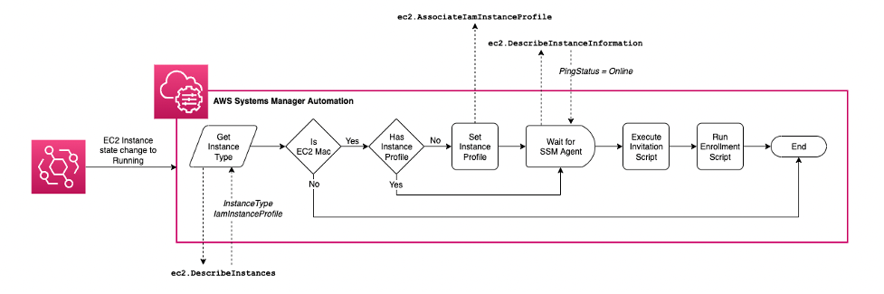

## EC2 Mac Auto Enrollment

This project is a repository for instructions and automations on how to automatically enroll [Amazon EC2 Mac](https://aws.amazon.com/pm/ec2-mac) instances into [Jamf Pro](https://www.jamf.com/).

Since the release of Amazon EC2 Mac Instances, AWS customers have been able to provision Apple Mac devices in the AWS cloud. By taking advantage of AWS’ scalable and elastic infrastructure, they have been able to increase developer productivity and deliver macOS and iOS apps to market faster without the need to manage physical Mac infrastructure. Until now, there wasn’t an easy way to integrate the EC2 Mac instances into the same device management as physical Apple devices. In partnership with Jamf, the leader in Apple device management, AWS has developed integration between the Amazon EC2 Mac instances and Jamf Pro to simplify managing, securing, and configuring EC2 Mac instances. In this blog post we show the reader show how to configure their AWS and Jamf accounts to automatically enroll EC2 Mac into Jamf Pro instances when they are launched.

### Prerequisites
* Jamf Pro Account
* AWS Account

### Why EC2 Mac and Jamf?
Amazon EC2 Mac instances allow you to run on-demand macOS workloads in the cloud to extend AWS's flexibility, scalability, and cost benefits to all Apple developers. Amazon EC2 Mac allows organizations to secure and manage their Macs used in their Mac development pipeline. Moving to EC2 Mac can provide increased security, scalability, and delivery speeds while reducing the total cost of ownership of Mac assets. With the recent general availability of Amazon EC1 M1 Mac instances, they have become even more powerful.

With the ability to effectively manage EC2 Mac instance configuration with Jamf Pro, customers can secure, inventory, and manage EC2 Mac with the same platform managing all their enterprise Apple devices. Automatic EC2 Mac enrollment into Jamf Pro allows IT to use the Jamf binary application to inventory and control devices with proven methods. It also enables end users to use Jamf Self Service to set up EC2 Mac to meet their needs in accordance with their organization’s policies.

## Getting Started
### Automated Enrollment with Systems Manager
**Note: The macOS support for AWS Systems Manager is limited to x86_64 versions of macOS in us-east-1, us-east-2, us-west-2, eu-west-1, and ap-southeast-1.**

The simplest way to get started is to use the [autoenrollment cloudformation](template.yaml) template. This template will create an AWS Systems Manager Automation that creates an Amazon EventBridge rule that executes a Systems Manager Automation to enroll any EC2 Mac instances.

The EC2 Mac instance sends the running status event to Amazon Event Bridge, which forwards the message to AWS Systems Manager, which in turn executes a script on the original EC2 Mac instance.

The first step is to get the instance type and IAM Instance Profile via the ec2.DescribeInstance API call. If that instance type is EC2 Mac, then check the instance profile. If the EC2 Mac instance has no instance profile assigned, one is assigned via the EC2 AssociateIamInstanceProfile API. The next step waits for the EC2 DescribeInstanceInformation API to return the PingStatus value of Online. The next executes the Invitation script followed by the Enrollment script. The final step ends the automation.

## Custom AMI
For more control of the macOS operating system, you can create a custom AMI that commes with Jamf preinstalled, and will include any profiles installed as part of the Jamf configuration of the instance that creates the custom AMI.

**Add more detail**

### Notes
* Copy the [enrollment.sh](enrollment.sh) file onto the instance.
* install jamf 
* Perform a [User Initiated Enrollment](https://docs.jamf.com/10.33.0/jamf-pro/administrator-guide/User-Initiated_Enrollment_for_Computers.html) 

## Security

See [CONTRIBUTING](CONTRIBUTING.md#security-issue-notifications) for more information.

## License

This library is licensed under the MIT-0 License. See the LICENSE file.

