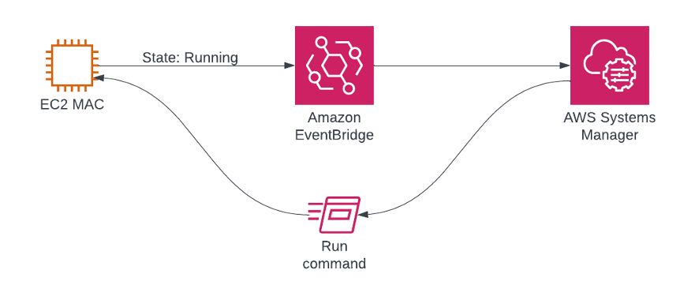

## EC2 Mac Auto Enrollment

---

Looking to add **MDM enrollment** to your workflow? Our **[new repository](https://github.com/aws-samples/amazon-ec2-mac-mdm-enrollment-automation)** has a workflow for full Jamf MDM enrollment automation.

---

This project is a repository for instructions and automations on how to automatically enroll [Amazon EC2 Mac](https://aws.amazon.com/pm/ec2-mac) instances into [Jamf Pro](https://www.jamf.com/).

Since the release of Amazon EC2 Mac Instances, AWS customers have been able to provision Apple Mac devices in the AWS cloud. By taking advantage of AWS’ scalable and elastic infrastructure, they have been able to increase developer productivity and deliver macOS and iOS apps to market faster without the need to manage physical Mac infrastructure. Until now, there wasn’t an easy way to integrate the EC2 Mac instances into the same device management as physical Apple devices. In partnership with Jamf, the leader in Apple device management, AWS has developed integration between the Amazon EC2 Mac instances and Jamf Pro to simplify managing, securing, and configuring EC2 Mac instances. In this blog post we show the reader show how to configure their AWS and Jamf accounts to automatically enroll EC2 Mac into Jamf Pro instances when they are launched.

### Prerequisites
* Jamf Pro Account
* AWS Account

### Why EC2 Mac and Jamf?
Amazon EC2 Mac instances allow you to run on-demand macOS workloads in the cloud to extend AWS's flexibility, scalability, and cost benefits to all Apple developers. Amazon EC2 Mac allows organizations to secure and manage their Macs used in their Mac development pipeline. Moving to EC2 Mac can provide increased security, scalability, and delivery speeds while reducing the total cost of ownership of Mac assets. With the recent general availability of Amazon EC1 M1 Mac instances, they have become even more powerful.

With the ability to effectively manage EC2 Mac instances' configuration with Jamf Pro, customers can secure, inventory, and manage EC2 Mac with the same platform already managing all their enterprise Apple devices. Automatic EC2 Mac enrollment into Jamf Pro allows IT to use the Jamf binary application to inventory and control devices with proven methods. It also enables end users to use Jamf Self Service to set up EC2 Mac to meet their needs in accordance with their organization’s policies.

## Getting Started
### Automated Enrollment with Systems Manager
**Note: The macOS support for AWS Systems Manager is limited to x86_64 versions of macOS in us-east-1, us-east-2, us-west-2, eu-west-1, and ap-southeast-1.**

The simplest way to get started is to use the [autoenrollment CloudFormation](template.yaml) template. This template will create an AWS Systems Manager Automation that creates an Amazon EventBridge rule that executes a Systems Manager Automation to enroll any EC2 Mac instances.

The EC2 Mac instance sends the running status event to Amazon Event Bridge, which forwards the message to AWS Systems Manager, which in turn executes a script on the original EC2 Mac instance.

The first step is to get the instance type and IAM Instance Profile via the ec2.DescribeInstance API call. If that instance type is EC2 Mac, then check the instance profile. If the EC2 Mac instance has no instance profile assigned, one is assigned via the EC2 AssociateIamInstanceProfile API. The next step waits for the EC2 DescribeInstanceInformation API to return the PingStatus value of Online. The next executes the Invitation script followed by the Enrollment script. The final step ends the automation.

## Custom Amazon Machine Image (AMI)
For more control of the macOS operating system, you can create a custom AMI that commes with Jamf preinstalled, and will include any profiles installed as part of the Jamf configuration of the instance that creates the custom AMI. 

Every EC2 instance starts with an AMI. By default, it contains an image of the operating system, required binaries, and configuration changes to integrate the OS with AWS. Taking a snapshot of a pre-configured EC2 Mac instance can not only streamline deployment, it also can cut down on time and bandwidth by pre-installing large software packages and common binaries. Once you start an instance and make changes, it's possible to create a *derivative AMI* from that, which includes any changes made to the instance from when it was started.

To create a derivative AMI using the AWS Console, first, log into your EC2 Mac instance to make your changes. Enrollment, verification, installation, any actions you'd like to ensure are ready on first boot. Once that's done, go to the EC2 section, then select the specific instance you'd like to create the derivative AMI from. Go to *Actions -> Image & Templates -> Create image*. Give the derivative AMI a name, description, and tags (if applicable), and click 
*Create image*. Your AMI will be ready to launch new instances from in a few minutes, and its status can be monitored in *Images -> AMIs*.

## Limits of Jamf-enrolled derivative AMIs
After a derivative AMI is created from an enrolled instance, that AMI can be run on other physical Mac hosts. If the AMI is started on a different host to the one it was created on, management of the new instance carries limitations:

 * It *will* keep in place any profiles already deployed to it.
 * It *will not* receive any new profiles scoped to it.
 * It *will* remain in communication with Jamf via the ^jamf binary.
 * It *will not* receive MDM commands from the Jamf server, only policy.
 * * If MDM commands are required, see [this workflow](https://github.com/aws-samples/amazon-ec2-mac-mdm-enrollment-automation) instead.
 
With these limits in mind, considerations around managing EC2 Mac instances may be slightly different than end-user hardware, but pushing policies and packages will function as Jamf normally does.

### Notes
* Copy the [enrollment.sh](enrollment.sh) file onto the instance.
* install jamf 
* Perform a [User Initiated Enrollment](https://docs.jamf.com/10.33.0/jamf-pro/administrator-guide/User-Initiated_Enrollment_for_Computers.html) 

## Security

See [CONTRIBUTING](CONTRIBUTING.md#security-issue-notifications) for more information.

## License

This library is licensed under the MIT-0 License. See the LICENSE file.

